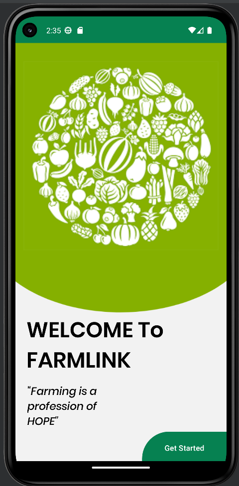

# FarmLink-Mobile-application
MAD project Y2S2

Farmlink is an Android app that empowers farmers in Sri Lanka by
connecting them directly with consumers, eliminating intermediaries and
ensuring fair prices, it offers transparency, efficiency, and market access,
benefiting both farmers and customers, and potentially aiding the
nation's economic revival.
Developed with Kotlin and Firebase

 

